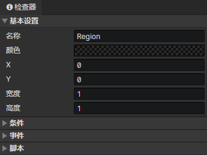

# 场景 - 区域

### 基本设置

- 名称：场景区域的名称，没有实际用处
- 颜色：可按区域作用设置不同的颜色
- X：区域在场景网格中的初始水平位置
- Y：区域在场景网格中的初始垂直位置
- 宽度：区域在场景网格中的宽度
- 高度：区域在场景网格中的高度

### 条件列表

在加载场景阶段，当达成条件时才会创建这个区域，场景预设区域可以设置一个永久保存的独立变量

### 区域事件列表

在事件中访问<事件触发区域>获取本区域

- 自动执行：区域出现在场景时自动执行，包括读取存档后
- 玩家进入：玩家角色进入区域时触发事件，在事件中访问<事件触发角色>获取相关角色
- 玩家离开：玩家角色离开区域时触发事件，在事件中访问<事件触发角色>获取相关角色
- 角色进入：任意角色进入区域时触发事件，在事件中访问<事件触发角色>获取相关角色
- 角色离开：任意角色离开区域时触发事件，在事件中访问<事件触发角色>获取相关角色
- 自定义事件：可通过<调用事件>指令调用自定义事件

### 区域脚本列表

添加Javascript文件来扩展区域