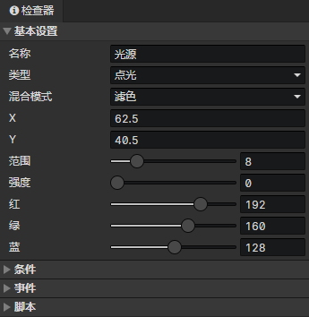
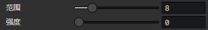
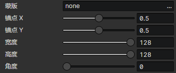

# 场景 - 光源

### 基本设置

- 名称：场景光源的名称，没有实际用处
- 类型
  - 点光：从一个点向周围呈圆形扩散并带有衰减的光源，启用参数(范围，强度)
  - 区域光：使用一个贴图作为光源，启用参数(蒙版，锚点X，锚点Y，宽度，高度，角度)，可以用来制作聚光灯效果
- 混合模式：滤色、加法、减法、最大值
- X：光源在场景网格中的初始水平位置
- Y：光源在场景网格中的初始垂直位置
- 宽度：光源在场景网格中的宽度
- 高度：光源在场景网格中的高度

- 点光源参数
  - 范围：光源的直径大小(0 ~ 128)
  - 强度：强度越大，光源内部衰减越小，更加明亮
  - 红：点光源中心的红色分量
  - 绿：点光源中心的绿色分量
  - 蓝：点光源中心的蓝色分量

- 区域光源参数
  - 蒙版：光线透过蒙版图像投射到场景中，如果未设置，则显示为一个矩形
  - 锚点X：光源的蒙版图像连接点的水平位置(0 ~ 1)
  - 锚点Y：光源的蒙版图像连接点的垂直位置(0 ~ 1)
  - 宽度：矩形区域的宽度
  - 高度：矩形区域的高度
  - 角度：矩形区域的旋转角度
  - 红：原始渲染颜色(红) \* 蒙版图像颜色(红) \* 红 / 255 = 最终渲染颜色(红)
  - 绿：原始渲染颜色(绿) \* 蒙版图像颜色(绿) \* 绿 / 255 = 最终渲染颜色(绿)
  - 蓝：原始渲染颜色(蓝) \* 蒙版图像颜色(蓝) \* 蓝 / 255 = 最终渲染颜色(蓝)

### 条件列表

在加载场景阶段，当达成条件时才会创建这个光源，场景预设光源可以设置一个永久保存的独立变量

### 光源事件列表

在事件中访问<事件触发光源>获取本光源

- 自动执行：光源出现在场景时自动执行，包括读取存档后
- 自定义事件：可通过<调用事件>指令调用自定义事件

### 光源脚本列表

添加Javascript文件来扩展光源