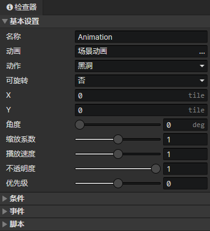

# 场景 - 动画

### 基本设置

- 名称：场景动画的名称，没有实际用处
- 动画：绑定的动画文件
- 动作：绑定的动画文件中的一个动作
- 可旋转：开启时，动画受<角度>影响进行旋转
- X：动画在场景网格中的初始水平位置
- Y：动画在场景网格中的初始垂直位置
- 角度：动画的角度，会影响<动作方向>的切换
- 缩放系数：动画帧的整体缩放系数
- 播放速度：动画的播放速度
- 不透明度：可以调节动画在场景中的可见度
- 优先级：动画在渲染时的排序优先级，位置在下方的动画总是会遮挡上方的动画
  - 优先级 = -1，表示排序位置向上偏移一个图块的距离
  - 优先级 = 1，表示排序位置向下偏移一个图块的距离

### 条件列表

在加载场景阶段，当达成条件时才会创建这个动画，场景预设动画可以设置一个永久保存的独立变量

### 动画事件列表

- 自动执行：动画出现在场景时自动执行，包括读取存档后
- 自定义事件：可通过<调用事件>指令调用自定义事件

### 动画脚本列表

添加Javascript文件来扩展动画