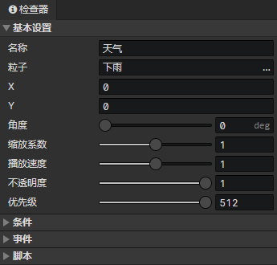

# 场景 - 粒子

### 基本设置

- 名称：场景粒子的名称，没有实际用处
- 粒子：绑定的粒子文件
- X：粒子在场景网格中的初始水平位置
- Y：粒子在场景网格中的初始垂直位置
- 角度：粒子发射器的角度
- 缩放系数：粒子的整体缩放系数
- 播放速度：粒子的播放速度
- 不透明度：可以调节粒子在场景中的可见度
- 优先级：粒子在渲染时的排序优先级，位置在下方的粒子总是会遮挡上方的粒子
  - 优先级 = -1，表示排序位置向上偏移一个图块的距离
  - 优先级 = 1，表示排序位置向下偏移一个图块的距离

### 条件列表

在加载场景阶段，当达成条件时才会创建这个粒子，场景预设粒子可以设置一个永久保存的独立变量

### 粒子事件列表

- 自动执行：粒子出现在场景时自动执行，包括读取存档后
- 自定义事件：可通过<调用事件>指令调用自定义事件

### 粒子脚本列表

添加Javascript文件来扩展粒子