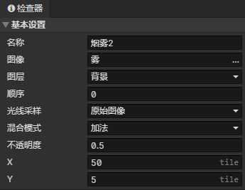
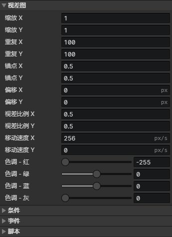

# 场景 - 视差图

### 基本设置

- 名称：场景视差图的名称，没有实际用处
- 图像：视差图的图像文件
- 图层：背景层、前景层
- 顺序：同一个图层的视差图和瓦片地图一起按顺序进行排序，当顺序相等时，按在场景对象列表中出现的顺序进行排序
- 光线采样
  - 原始图像：不受光照影响
  - 全局采样：从图像所在的多个像素点位置采样光照合成最终颜色
  - 锚点采样：从图像所在的锚点位置采样光照合成最终颜色
  - 环境光：使用当前场景的环境光合成最终颜色
- 混合模式：正常、加法、减法
- 不透明度：可以调节视差图在场景中的可见度
- X：视差图在场景网格中的初始水平位置
- Y：视差图在场景网格中的初始垂直位置

:::tip

视差图也可以用来当作场景地图，替代瓦片地图的作用

:::

### 视差图设置

- 缩放X：视差图的水平缩放系数
- 缩放Y：视差图的垂直缩放系数
- 重复X：视差图的水平平铺次数
- 重复Y：视差图的垂直平铺次数
- 锚点X：视差图跟场景的连接点的水平位置(0 ~ 1)
- 锚点Y：视差图跟场景的连接点的垂直位置(0 ~ 1)
- 偏移X：视差图的水平偏移距离(单位：像素)
- 偏移Y：视差图的垂直偏移距离(单位：像素)
- 视差比例X：当场景摄像机移动时，视差图移动的水平距离的系数
- 视差比例Y：当场景摄像机移动时，视差图移动的垂直距离的系数
- 移动速度X：视差图纹理自动滚动的水平速度(单位：像素/秒)
- 移动速度Y：视差图纹理自动滚动的垂直速度(单位：像素/秒)
- 色调 - 红：视差图颜色(红) + 色调(红) = 最终渲染颜色(红)
- 色调 - 绿：视差图颜色(绿) + 色调(绿) = 最终渲染颜色(绿)
- 色调 - 蓝：视差图颜色(蓝) + 色调(蓝) = 最终渲染颜色(蓝)
- 色调 - 灰度：灰度与饱和度相反，灰度越高则饱和度越低

### 条件列表

在加载场景阶段，当达成条件时才会创建这个视差图，场景预设视差图可以设置一个永久保存的独立变量

### 视差图事件列表

- 自动执行：视差图出现在场景时自动执行，包括读取存档后
- 自定义事件：可通过<调用事件>指令调用自定义事件

### 视差图脚本列表

添加Javascript文件来扩展视差图