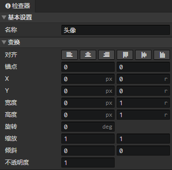
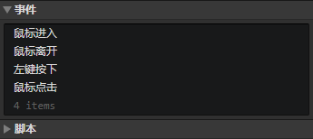

# 界面 - 通用

### 基本设置

- 名称：元素的名称，没有实际用处

### 变换

- 对齐：左对齐、水平居中、右对齐、顶部对齐、垂直居中、底部对齐
- 锚点：元素跟容器的连接点的水平 + 垂直位置
- X：元素在容器中的水平位置，像素值 + 容器宽度的比例值
- Y：元素在容器中的水平位置，像素值 + 容器高度的比例值
- 宽度：元素的宽度，像素值 + 容器宽度的比例值
- 高度：元素的高度，像素值 + 容器高度的比例值
- 旋转：元素绕锚点的旋转角度，正右方 = 0度，顺时针旋转
- 缩放：元素的水平 + 垂直缩放系数，设为-1等于翻转
- 倾斜：元素的水平 + 垂直倾斜系数
- 不透明度：可以调节元素的可见度

### 元素事件列表

- 自动执行：元素出现后触发事件
- 左键按下：鼠标左键按下时触发事件
- 右键按下：鼠标右键按下时触发事件
- 鼠标按下：鼠标左键、中键、右键、侧键按下时触发，通过<设置数值>指令获取按键值，通过条件指令检查按键值(0 ~ 4)。
- 左键弹起：鼠标左键弹起时触发事件
- 右键弹起：鼠标右键弹起时触发事件
- 鼠标弹起：鼠标左键、中键、右键、侧键弹起时触发，通过<设置数值>指令获取按键值，通过条件指令检查按键值(0 ~ 4)。
- 鼠标移动：鼠标在元素中移动时触发事件
- 鼠标进入：鼠标进入元素矩形区域时触发事件
- 鼠标离开：鼠标离开元素矩形区域时触发事件
- 鼠标点击：鼠标在元素中按下，一直保持在元素矩形区域中，鼠标弹起时触发事件
- 鼠标双击：鼠标连续按下两次，在第二次按下时触发事件
- 滚轮滑动：鼠标滚轮向上或向下滑动时触发事件，通过<设置数值>指令获取事件触发鼠标滚轮Y，如果小于0，表示向上滑动，如果大于0，表示向下滑动
- 输入事件：文本框特有事件，在文本框中输入文字将会触发事件
- 获得焦点：文本框特有事件，鼠标点击文本框进入输入模式将会触发事件
- 失去焦点：文本框特有事件，鼠标点击文本框外部，当文本框从输入模式退出时触发事件
- 销毁事件：使用<删除元素>指令删除一个元素，在被删除前触发事件
- 自定义事件：可通过<调用事件>指令调用自定义事件

:::tip

出于性能优化考虑，如果一个元素的位置处于父元素的外部，点击外面的部分将不会触发指针事件，比如：鼠标按下等

:::

### 元素脚本列表

添加Javascript文件来扩展元素