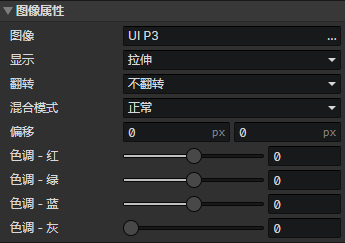

# 界面 - 图像

### 图像属性

可通过<设置图像><改变图像色调>事件指令修改图像属性

- 图像：元素的图像文件
- 显示
  - 拉伸：启用参数(翻转，偏移X，偏移Y)
  - 平铺：启用参数(翻转，偏移X，偏移Y)
  - 裁剪：启用参数(翻转，裁剪)，绘制矩形裁剪区域中的图像到屏幕中
  - 切片：启用参数(裁剪，边框)，根据边框大小将图像切成9份(4个角，4条边，中间1个矩形)，平铺到元素中
- 翻转
  - 不翻转
  - 水平翻转
  - 垂直翻转
  - 水平垂直翻转
- 混合模式
  - 正常
  - 加法
  - 减法
  - 遮罩：启用遮罩模式后，子元素中的图像和当前图像重叠部分将被渲染，颜色1(RGB) \* 颜色2(RGB) / 255 = 最终渲染颜色
- 偏移X：图像纹理的水平偏移距离(单位：像素)
- 偏移Y：图像纹理的垂直偏移距离(单位：像素)
- 裁剪：裁剪指定的矩形区域部分的图像
- 边框：根据边框大小将图像切成9份(4个角，4条边，中间1个矩形)，平铺到元素中，边框 = 4个角的正方形边长
- 色调 - 红：图像颜色(红) + 色调(红) = 最终渲染颜色(红)
- 色调 - 绿：图像颜色(绿) + 色调(绿) = 最终渲染颜色(绿)
- 色调 - 蓝：图像颜色(蓝) + 色调(蓝) = 最终渲染颜色(蓝)
- 色调 - 灰度：灰度与饱和度相反，灰度越高则饱和度越低
