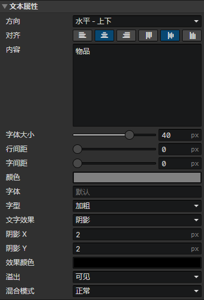

# 界面 - 文本

### 文本属性

可通过<设置文本>事件指令修改文本属性

- 方向
  - 水平 - 上下：文字从左向右排列，向下换行
  - 垂直 - 左右：文字从上向下排列，向右换行
  - 垂直 - 右左：文字从上向下排列，向左换行
- 对齐：左对齐、水平居中、右对齐、顶部对齐、垂直居中、底部对齐
- 内容：元素的文本内容，支持富文本标签，点击右键菜单->标签，插入富文本标签
- 字体大小：文本字体大小(10 ~ 400)，可以使用富文本标签修改
- 行间距：文本行的间隔距离(单位：像素)
- 字间距：同一行每个文字的间隔距离(单位：像素)
- 颜色：文字的初始颜色
- 字体：输入字体名称，如果有多个字体，用逗号隔开，按从左到右的优先顺序排列
- 字型：正常、加粗、倾斜、加粗 倾斜
- 文字效果
  - 无
  - 阴影：启用参数(阴影X，阴影Y，效果颜色)
  - 描边：启用参数(描边宽度，效果颜色)
  - 轮廓：类似于描边，线宽固定为1像素，启用参数(效果颜色)
- 阴影X：文字阴影的水平偏移距离(单位：像素)
- 阴影Y：文字阴影的垂直偏移距离(单位：像素)
- 描边宽度：文字描边线条的宽度，有一半在文字内部被遮挡，另一半在外部
- 效果颜色：阴影/描边/轮廓的颜色
- 溢出
  - 可见：允许文字出现在元素外面
  - 换行：当文字打印到元素边缘时，换一行继续打印，受项目设置->文本->自动换行(断开单词/保持完整的单词)影响
  - 截断：当换行后溢出时，停止打印文本
  - 换行 截断：同时具备换行和截断特性
- 混合模式：正常、加法、减法
