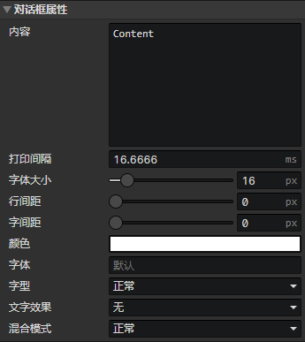

# 界面 - 对话框

### 对话框属性

可通过<设置对话框>事件指令修改对话框属性，通过<控制对话框>事件指令控制对话框打印

- 内容：元素的文本内容，支持富文本标签，点击右键菜单->标签，插入富文本标签
- 打印间隔：如果设置为0，直接打印所有文字，否则按照间隔持续打印文字，直到打印结束或者当前页面被填满
- 字体大小：文本字体大小(10 ~ 400)，可以使用富文本标签修改
- 行间距：文本行的间隔距离(单位：像素)
- 字间距：同一行每个文字的间隔距离(单位：像素)
- 颜色：文字的初始颜色
- 字体：输入字体名称，如果有多个字体，用逗号隔开，按从左到右的优先顺序排列
- 字型：正常、加粗、倾斜、加粗 倾斜
- 文字效果
  - 无
  - 阴影：启用参数(阴影X，阴影Y，效果颜色)
  - 描边：启用参数(描边宽度，效果颜色)
  - 轮廓：类似于描边，扩阔线宽固定为1像素，启用参数(效果颜色)
- 阴影X：文字阴影的水平偏移距离(单位：像素)
- 阴影Y：文字阴影的垂直偏移距离(单位：像素)
- 描边宽度：文字描边线条的宽度，有一半在文字内部被遮挡，另一半在外部
- 效果颜色：阴影/描边/轮廓的颜色
- 混合模式：正常、加法、减法
