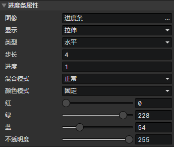

# 界面 - 进度条

### 进度条属性

可通过<设置进度条>事件指令修改进度条属性

- 图像：元素的图像文件
- 显示
  - 拉伸
  - 裁剪：启用参数(裁剪)
- 裁剪：裁剪指定的矩形区域部分的图像
- 类型
  - 水平
  - 垂直
  - 圆形：启用参数(中心X，中心Y，起始角度，圆心角度)
- 中心X：圆形进度条的圆心X
- 中心Y：圆形进度条的圆心Y
- 起始角度：圆形进度条的起始角度，正右方 = 0度，顺时针旋转
- 圆心角度：圆形进度条的结束角度减去起始角度的夹角
- 步长：水平/垂直进度条的纹理采样宽度是步长的整数倍，圆形进度条的纹理采样角度是步长的整数倍，步长 = 0，表示禁用
- 进度：进度条的初始进度(0 ~ 1)
- 混合模式
  - 正常
  - 加法
  - 减法
- 颜色模式
  - 纹理采样：使用进度条图像中的像素颜色
  - 固定：替换进度条图像中的像素为指定颜色，启用参数(红，绿，蓝，不透明度)
- 红：固定颜色模式下，进度条颜色的红色分量
- 绿：固定颜色模式下，进度条颜色的绿色分量
- 蓝：固定颜色模式下，进度条颜色的蓝色分量
- 不透明度：固定颜色模式下，进度条颜色的不透明度
