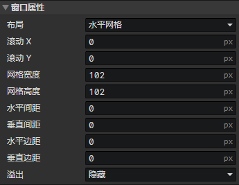

# 界面 - 窗口

### 窗口属性

- 布局
  - 正常：窗口仅作为一个元素容器
  - 水平网格：网格从左向右排列，向下换行
  - 垂直网格：网格从上向下排列，向右换行
- 滚动X：窗口的初始水平滚动位置(单位：像素)
- 滚动Y：窗口的初始垂直滚动位置(单位：像素)
- 网格宽度：单个网格的水平大小(单位：像素)
- 网格高度：单个网格的垂直大小(单位：像素)
- 水平间距：相邻网格的水平间隔距离(单位：像素)
- 垂直间距：相邻网格的垂直间隔距离(单位：像素)
- 水平边距：窗口的水平内边距(单位：像素)
- 垂直边距：窗口的垂直内边距(单位：像素)
- 溢出
  - 可见：允许窗口的子元素出现在窗口外面
  - 隐藏：隐藏窗口外部的子元素内容
