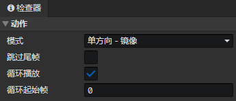

# 动画 - 动作

### 动作

- 模式
  - 单方向
  - 二方向：左、右
  - 四方向：下、左、右、上
  - 八方向：下、左、右、上、左下、右下、左上、右上
  - 单方向 - 镜像：右，镜像(左)
  - 三方向 - 镜像：下、右、上，镜像(左)
  - 五方向 - 镜像：下、右、上、右下、右上，镜像(左、左下、左上)
- 跳过尾帧：动画播放到最后一帧时，跳过。用于循环播放过渡的动画
- 循环播放：动画播放结束时自动回到<起始帧>继续播放
- 循环起始帧：动画循环播放的开始位置