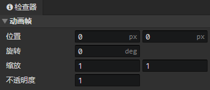

# 动画 - 关节动画帧

### 动画帧

- 位置：关节的水平/垂直位置(单位：像素)
- 旋转：正右方 = 0度，顺时针旋转
- 缩放：水平和垂直缩放，水平缩放(-1)，等于水平翻转，垂直缩放(-1)，等于垂直翻转
- 不透明度：动画精灵的可见度(0 ~ 1)

:::tip

关节层可以嵌套其他图层，通过这种方法把其他图层作为它的子图层，然后设置关节动画帧参数，可以整体移动、缩放、旋转所有的子图层

:::
