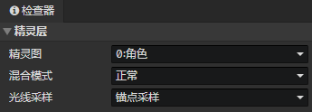

# 动画 - 精灵层

### 精灵层

- 精灵图：选择<动画设置>中预设的精灵
- 混合模式：正常、加法、减法
- 光线采样：在舞台中预览时效果不可见
  - 原始图像：不受光照影响
  - 全局采样：从图像所在的多个像素点位置采样光照合成最终颜色
  - 锚点采样：从图像所在的锚点位置采样光照合成最终颜色

:::tip

光线采样：建议角色精灵使用<锚点采样>，技能动画使用<原始图像>

:::