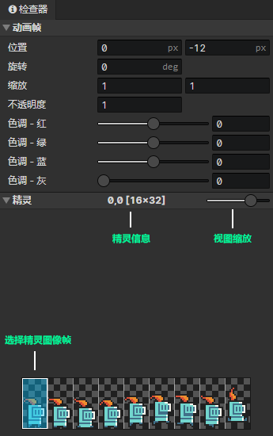

# 动画 - 精灵动画帧

### 动画帧

- 位置：精灵的水平/垂直位置(单位：像素)
- 旋转：正右方 = 0度，顺时针旋转
- 缩放：水平和垂直缩放，水平缩放(-1)，等于水平翻转，垂直缩放(-1)，等于垂直翻转
- 不透明度：动画精灵的可见度(0 ~ 1)
- 色调 - 红：图像颜色(红) + 色调(红) = 最终渲染颜色(红)
- 色调 - 绿：图像颜色(绿) + 色调(绿) = 最终渲染颜色(绿)
- 色调 - 蓝：图像颜色(蓝) + 色调(蓝) = 最终渲染颜色(蓝)
- 色调 - 灰度：灰度与饱和度相反，灰度越高则饱和度越低

:::tip

精灵锚点：固定在精灵的中心位置，可让精灵层作为关节层的子图层，改变锚点

:::

### 精灵

视图缩放：从左到右分别是25%、50%、100%、200%、400%五个缩放级别  
选择精灵图像帧：按下鼠标左键，或者键盘上下左右，选择精灵帧