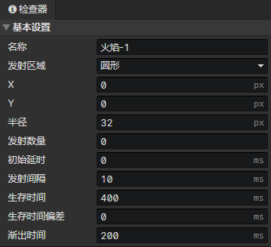
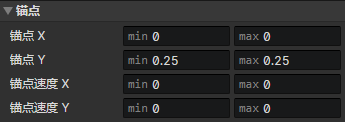
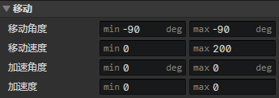
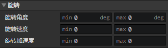
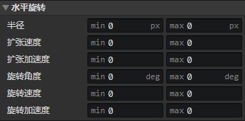
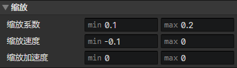
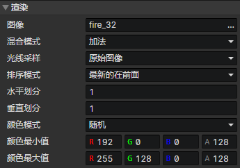

# 粒子 - 图层

### 基本设置

- 名称：图层名称
- 发射区域：
  - 点：粒子从一个固定点发射。启用参数(X，Y)
  - 矩形：粒子从矩形内部的随机位置发射，启用参数(X，Y，宽度，高度)
  - 圆形：粒子从圆形内部的随机位置发射，启用参数(X，Y，半径)
  - 屏幕边缘：粒子从屏幕边缘发射，发射位置跟初始移动角度有关，同时也有一些随机性，适合用来制作天气
- 发射数量：发射完指定数量后，停止发射粒子。如果设置为0则不限制数量。
- 初始延时：推迟发射粒子的时间。
- 发射间隔：粒子的发射间隔时间。
- 生存时间：粒子从发射到销毁的存在时间。
- 生存时间偏差：生存时间 ± 生存时间偏差 = 最终生存时间
- 渐出时间：粒子在销毁前过渡到透明的时间

### 锚点

- 锚点X：锚点的水平偏移距离，1 = 向右偏移<粒子宽度>的距离
- 锚点Y：锚点的垂直偏移距离，1 = 向下偏移<粒子高度>的距离
- 锚点速度X：每秒钟<锚点X>的改变量
- 锚点速度Y：每秒钟<锚点Y>的改变量

:::tip

锚点(0, 0)在粒子中心位置

:::

### 移动

- 移动角度：粒子初速度角度
- 移动速度：粒子初速度大小
- 加速角度：每秒钟<移动角度>的改变量
- 加速度：每秒钟<移动速度>的改变量

### 旋转

- 旋转角度：粒子初始角度
- 旋转速度：每秒钟<旋转角度>的改变量
- 旋转加速度：每秒钟<旋转速度>的改变量

### 水平旋转

- 半径：粒子左右来回运动的振幅，用于模拟绕Y轴旋转
- 扩张速度：每秒钟<半径>的改变量
- 扩张加速度：每秒钟<扩张速度>的改变量
- 旋转角度：Y轴到粒子水平旋转当前位置的角度，正右方 = 0度，顺时针旋转
- 旋转速度：每秒钟<旋转角度>的改变量
- 旋转加速度：每秒钟<旋转速度>的改变量

### 缩放

- 缩放系数：粒子大小的缩放系数，1 = 100%
- 缩放速度：每秒钟<缩放系数>的改变量
- 缩放加速度：每秒钟<缩放速度>的改变量

### 渲染

- 图像：粒子精灵图像
- 混合模式：正常、加法、减法
- 光线采样：
  - 原始图像：不受光照影响
  - 全局采样：从粒子所在的多个像素点位置采样光照合成最终颜色
  - 环境光：使用当前场景的环境光合成最终颜色
- 排序模式：
  - 最新的在前面：新生成的粒子显示在旧的粒子前面
  - 最旧的在前面：旧的粒子显示在新生成的粒子前面
  - 近大远小：缩放系数大的粒子显示在前面
- 水平划分：对粒子精灵图像水平等分切割，生成粒子时随机选择一列
- 垂直划分：对粒子精灵图像垂直等分切割，生成粒子时随机选择一行
- 颜色模式：
  - 固定：启用参数(颜色)
  - 随机：启用参数(颜色最小值，颜色最大值)
  - 过渡：启用参数(过渡方式，初始颜色最小值，初始颜色最大值，结束颜色最小值，结束颜色最大值)
  - 纹理采样：启用参数(色调 - 红，色调 - 绿，色调 - 蓝，色调 - 灰)