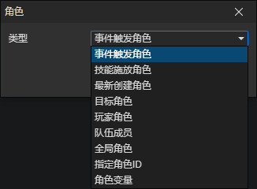

# 角色访问器

### 参数

- 类型
  - 事件触发角色：触发这个事件的角色，一般情况下指跟事件有关的角色，比如
    - 事件的宿主角色
    - 使用物品的角色
    - 穿上装备的角色
    - 施放技能的角色
    - 获得状态的角色
  - 技能施放角色：在施放技能事件、触发器的所有事件中可以访问
  - 最新创建角色：获取最新创建的角色对象，在调用<创建角色><创建全局角色>指令时刷新
  - 目标角色：一个暂时存放角色的容器
    - 在角色碰撞事件中可以访问，指向与<事件触发角色>碰撞的另一个角色
    - 在调用<探测目标>指令后，将从角色的目标池中获取符合条件的角色，作为目标角色，可能不存在(none)
    - 在调用<显示文本>指令后，被设置为该指令中的<角色访问器>获取到的角色，可能不存在(none)
  - 玩家角色：指向玩家角色，通过项目设置->角色->玩家角色，设置初始玩家角色。通过<设置玩家角色>指令修改
  - 队伍成员：获取玩家队伍中的成员角色，启用参数(成员索引)
  - 全局角色：通过角色文件的ID获取已创建的全局角色，启用参数(角色文件)
  - 指定角色ID：获取场景中预设的角色，启用参数(数据ID)
  - 角色变量：获取变量中的角色对象，启用参数(变量)
