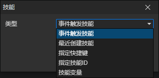

# 技能访问器

### 参数

- 类型
  - 事件触发技能：技能事件被触发时，通过访问<事件触发技能>获取这个技能
  - 最新创建技能：获取最新创建的技能对象，在调用<改变角色技能>指令添加技能时刷新
  - 指定快捷键：获取指定角色的快捷栏中的技能，启用参数(角色，快捷键)
  - 指定技能ID：获取指定角色的技能文件ID对应的技能，启用参数(角色，技能文件)
  - 技能变量：获取变量中的技能对象，启用参数(变量)
