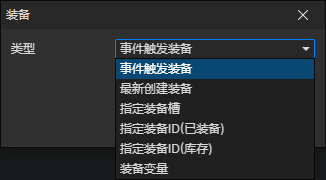

# 装备访问器

### 参数

- 类型
  - 事件触发装备：装备对象的事件被触发时，通过访问<事件触发装备>获取这个装备
  - 最新创建装备：获取最新创建的装备对象，在调用<改变角色装备>指令添加装备时刷新
  - 指定装备ID(已装备)：从指定角色的装备槽中获取装备文件ID对应的装备，启用参数(角色，装备文件)
  - 指定装备ID(库存)：从指定角色的库存中获取装备文件ID对应的装备，启用参数(角色，装备文件)
  - 装备变量：获取变量中的装备对象，启用参数(变量)
