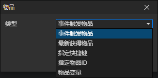

# 物品访问器

### 参数

- 类型
  - 事件触发物品：物品对象的事件被触发时，通过访问<事件触发物品>获取这个物品
  - 最新获得物品：指向最新获得的物品对象，在调用<设置库存>指令添加物品时刷新
  - 指定快捷键：获取指定角色的快捷栏中的物品，启用参数(角色，快捷键)
  - 指定物品ID：获取指定角色的物品文件ID对应的物品，启用参数(角色，物品文件)
  - 物品变量：获取变量中的物品对象，启用参数(变量)
