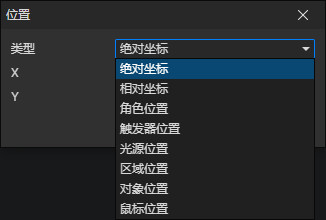

# 位置访问器

### 参数

- 类型
  - 绝对坐标：指定场景坐标(X，Y)
  - 相对坐标：指定当前对象位置的相对坐标(X，Y)，只有部分情况下有效
  - 角色位置：获取角色所在的位置
  - 触发器位置：获取触发器所在的位置
  - 光源位置：获取光源所在的位置
  - 区域位置：获取区域所在的位置
  - 对象位置：获取预设场景对象所在的位置
  - 鼠标位置：获取鼠标指针所在的场景位置
