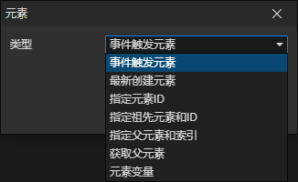

# 元素访问器

### 参数

- 类型
  - 事件触发元素：元素对象的事件被触发时，通过访问<事件触发元素>获取这个元素
  - 最新创建元素：指向最新创建的元素对象，在调用<创建元素>指令时刷新
  - 指定元素ID：获取最新创建的ID匹配的元素，启用参数(数据ID)
  - 指定祖先元素和ID：在指定元素的后代元素中获取ID匹配的第一个元素，启用参数(元素，数据ID)
  - 指定父元素和索引：在指定元素的子元素列表中获取一个元素，索引0 = 第1个子元素，索引1 = 第2个子元素，......
  - 获取父元素：获取指定变量元素的父元素，启用参数(变量)
  - 元素变量：获取变量中的元素对象，启用参数(变量)
