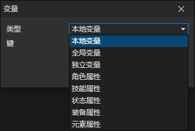

# 变量访问器

### 参数

- 类型
  - 本地变量：存放在事件中的临时变量，当事件执行结束时就被销毁
  - 全局变量：用户预设的变量，永久保存在游戏存档中
  - 独立变量：只有场景中的预设对象才拥有的属性，永久保存在游戏存档中
  - 角色属性：可自定义的角色属性，在属性管理器[F6]中编辑
  - 技能属性：可自定义的技能属性，在属性管理器[F6]中编辑
  - 状态属性：可自定义的状态属性，在属性管理器[F6]中编辑
  - 装备属性：可自定义的装备属性，在属性管理器[F6]中编辑
  - 元素属性：可自定义的元素属性，在属性管理器[F6]中编辑，支持对象类型

:::tip

全局变量分为以下几种：

- 普通变量：写入到独立存档的变量
- 共享变量：写入到共享存档的变量，就是所谓的二周目变量，运行游戏时自动加载，退出游戏时自动保存
- 临时变量：不会写入到存档，重置游戏时也跟着一起重置，但支持对象类型

:::

:::tip

变量类型说明：

- 布尔值：只有两种值，true、false
- 数值：最常用的变量类型，0，1，-2，3.1415926，......
- 字符串：用来保存文字的变量类型，比如角色名，描述，职业等信息（枚举值也是字符串类型）
- 对象：角色、技能、状态、装备、物品、触发器、光源、元素、列表等统称为对象，可以在这一类变量中读写
- 列表：可以按顺序存放多个数据(布尔值、数值、字符串、对象)的容器，列表也属于对象

:::
