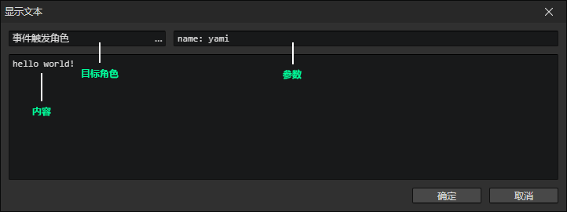
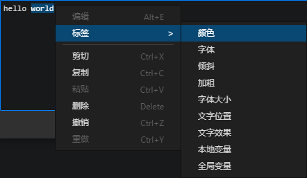
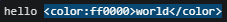
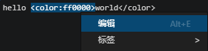

# 显示文本

- 目标角色：获取的角色，将被设置到角色访问器->目标角色
- 参数：通过参数控制对话框的样式
  - 格式：参数名: 参数值, ...如果有多个参数用逗号隔开
  - 布尔值参数例子：bool1, bool2: true, bool3: false，如果省略了参数值则等价于true
  - 数值参数例子：number: 233
  - 字符串参数例子：string: hello world
- 内容：对话文本

执行这个指令将会自动调用一个预先设置的公共事件（在窗口->项目设置中修改）  
通过角色访问器->目标角色，读取指令中的角色  
通过<设置布尔值><设置数值><设置字符串>指令，读取对应类型的参数  
通过<设置字符串>，读取指令中的内容  
这个指令的作用就是调用预设的事件来处理这些参数，创建对话框，加载对话内容

:::tip

默认模板可选参数：

- mode: chat，显示气泡框样式
- name: xxxx，使用指定的角色名称
- duration: 4000，使用气泡框时，可以指定持续时间(毫秒)

参数配合<改变角色头像>指令可实现表情切换，比如：

- face: smile，在公共事件中获取该参数，改变角色头像，对话结束后恢复头像

:::

### 插入标签

- 通过上下文菜单->标签，插入富文本标签和变量

:::tip

选中文本后，再插入标签，可以将标签直接插入到选中文本的两端

在标签位置按下鼠标右键打开上下文菜单，可以编辑标签

:::

