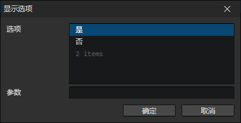

# 显示选项

- 选项列表：设置选项分支，不限数量
- 参数：通过参数控制选项窗口的样式
  - 格式：参数名: 参数值, ...如果有多个参数用逗号隔开
  - 布尔值参数例子：bool1, bool2: true, bool3: false，如果省略了参数值则等价于true
  - 数值参数例子：number: 233
  - 字符串参数例子：string: hello world

执行这个指令将会自动调用一个预先设置的公共事件（在窗口->项目设置中修改）  
通过<设置字符串>指令，读取选项内容  
通过<设置布尔值><设置数值><设置字符串>指令，读取对应类型的参数  
这个指令的作用就是调用预设的事件来处理处理这些参数，创建选项窗口，加载选项内容

:::tip

默认模板未实现<显示选项>指令的可用参数

:::
