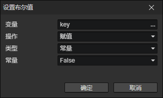

# 设置布尔值

只有当变量是布尔值类型或不存在，且操作值是布尔值类型时，才能成功写入

- 变量：写入的目标变量访问器
- 操作
  - 赋值：设置为操作值
  - 非：设置为操作值的相反值
  - 与：当目标变量与操作值都是True，设置为True，否则设置为False
  - 或：当目标变量与操作值至少有一个是True，设置为True，否则设置为False
  - 异或：当目标变量与操作值不一样时，设置为True，否则设置为False
- 类型
  - 常量：True或False
  - 变量：使用变量访问器
  - 列表项
    - 变量：存放列表对象的变量
    - 索引：读取列表中第N(0, 1, 2, ...)个位置的值
  - 参数：<显示文本><显示选项>指令中输入的参数
  - 脚本：Javascript的返回值