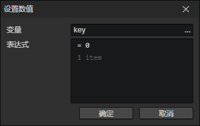
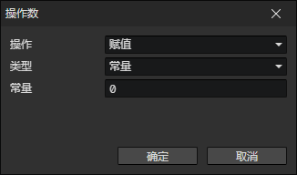

# 设置数值

可用来设置角色属性、技能属性、装备属性，以及计算伤害公式等  
只有当变量是数值类型或不存在，且操作值是数值类型时，才能成功写入

- 变量：写入的目标变量访问器
- 表达式：可以添加多个操作值，返回运算结果

### 操作数

- 操作
  - 赋值：第一个操作数可选<赋值>操作，将最终结果设置到目标变量
  - 加法：两个值相加
  - 减法：两个值相减
  - 乘法：两个值相乘，高优先级
  - 除法：两个值相除，高优先级
  - 取余：左边的值除以右边的值，取余数，高优先级
  - (加法，减法，乘法，除法，取余)：高优先级
- 类型
  - 常量：可以确定的数值
  - 变量：使用变量访问器
  - 数学
    - 四舍五入
      - 保留小数位：如果保留2位小数，1.2345四舍五入结果是1.23
    - 向下取整：1.8向下取整结果是1
    - 向上取整：1.8向上取整结果是2
    - 开平方根
    - 取绝对值
    - 取余弦值
    - 取正弦值
    - 取正切值
    - 取随机数[0, 1)：生成0到1之间的随机数(不包括1)
    - 随机整数：随机整数[0, 2]的可能值是0, 1, 2
    - 距离：计算两个位置的距离
    - 水平距离：计算两个位置的X轴距离
    - 垂直距离：计算两个位置的Y轴距离
    - 相对角度：计算位置A到位置B的角度，正右方 = 0度，顺时针旋转
  - 字符串
    - 获取长度：获取字符串中有几个字符，比如："abcd"的返回结果是4
    - 解析数值：把一个字符串解析为数值，比如："12.34"的返回结果是12.34
    - 获取搜索字符串的索引：在字符串中搜索子字符串的位置，比如：在"abcdefg"中，搜索"abc"，返回结果是0，搜索"cdef"，返回结果是2。（首个字符的位置是0）搜索"h"，返回结果是-1，表示不存在。
  - 对象
    - 角色 - X：角色在场景中的坐标X
    - 角色 - Y：角色在场景中的坐标Y
    - 角色 - 屏幕X：将角色的场景坐标X转换为屏幕坐标X(单位：像素)
    - 角色 - 屏幕Y：将角色的场景坐标Y转换为屏幕坐标Y(单位：像素)
    - 角色 - 角度
    - 角色 - 方向角度：角色动画动作的方向对应的角度（单方向始终为0，二方向可能是0/180，四方向可能是0/90/180/270）
    - 角色 - 移动速度
    - 角色 - 碰撞体积
    - 角色 - 碰撞体重
    - 角色 - 物品数量
    - 角色 - 装备数量
    - 角色 - 库存金钱
    - 角色 - 库存已用空间：库存中被物品和装备占用的格子数量
    - 角色 - 库存版本号：角色的库存增减物品/装备时，版本号递增
    - 角色 - 技能版本号：角色的技能列表发生改变时，版本号递增
    - 角色 - 状态版本号：角色的状态列表发生改变时，版本号递增
    - 角色 - 装备版本号：角色的装备槽发生改变时，版本号递增
    - 角色 - 快捷栏版本号：角色的快捷栏发生改变时，版本号递增
    - 角色 - 动画当前时间
    - 角色 - 动画持续时间
    - 角色 - 动画播放进度：动画当前时间 / 动画持续时间 = 动画播放进度
    - 角色 - 当前冷却时间：获取指定<冷却键>对应的当前冷却时间
    - 角色 - 最大冷却时间：获取指定<冷却键>对应的最大冷却时间
    - 角色 - 冷却进度：当前冷却时间 / 最大冷却时间 = 冷却进度
    - 技能 - 当前冷却时间
    - 技能 - 最大冷却时间
    - 技能 - 冷却进度：当前冷却时间 / 最大冷却时间 = 冷却进度
    - 状态 - 当前时间
    - 状态 - 最大时间
    - 状态 - 进度：当前时间 / 最大时间 = 进度
    - 装备 - 在库存中的顺序
    - 物品 - 在库存中的顺序
    - 物品 - 数量
    - 触发器 - 速度
    - 触发器 - 角度
    - 列表 - 长度：列表中的数据数量
  - 元素
    - 元素 - 子元素的数量
    - 变换 - 锚点X
    - 变换 - 锚点Y
    - 变换 - X
    - 变换 - Y
    - 变换 - 宽度
    - 变换 - 高度
    - 变换 - X2
    - 变换 - Y2
    - 变换 - 宽度2
    - 变换 - 高度2
    - 变换 - 旋转
    - 变换 - 缩放X
    - 变换 - 缩放Y
    - 变换 - 倾斜X
    - 变换 - 倾斜Y
    - 变换 - 不透明度
    - 窗口 - 可见的网格列数
    - 窗口 - 可见的网格行数
    - 文本 - 文本宽度：已渲染文本的实际宽度
    - 文本 - 文本高度：已渲染文本的实际高度
    - 文本框 - 数值：要求文本框元素必须是数值类型
    - 对话框 - 打印结束位置X
    - 对话框 - 打印结束位置Y
  - 列表项：
    - 变量：存放列表对象的变量
    - 索引：读取列表中第N(0, 1, 2, ...)个位置的值
  - 参数：<显示文本><显示选项>指令中输入的参数
  - 脚本：Javascript的返回值
  - 其他
    - 事件触发鼠标按键：获取当前触发的"鼠标事件"的按键码
    - 事件触发鼠标滚轮Y：获取当前触发的"滚轮滑动事件"的DeltaY值(小于0：向上滑动，大于0：向下滑动)
    - 鼠标屏幕X：鼠标在屏幕中的水平位置(单位：像素)
    - 鼠标屏幕Y：鼠标在屏幕中的垂直位置(单位：像素)
    - 鼠标场景X：鼠标在场景中的水平位置(单位：图块)
    - 鼠标场景Y：鼠标在场景中的垂直位置(单位：图块)
    - 初始位置X：场景舞台->上下文菜单->设置初始位置，可修改
    - 初始位置Y：场景舞台->上下文菜单->设置初始位置，可修改
    - 摄像机X：摄像机的中心在场景中的水平位置
    - 摄像机Y：摄像机的中心在场景中的垂直位置
    - 摄像机缩放率
    - 屏幕宽度：游戏分辨率的宽度
    - 屏幕高度：游戏分辨率的高度
    - 场景宽度：场景水平网格数量
    - 场景高度：场景垂直网格数量
    - 累计游戏时间：玩家从<新游戏>到当前的游玩时间，记录到存档中
    - 游戏运行时间：从打开应用到现在运行的时间，退出游戏后清零
    - 当前帧的时间增量：上一帧结束到当前帧开始经过的时间(单位：毫秒)，60FPS时可能为16.66，如果游戏速度是2，则时间增量也缩放到2倍，为33.33ms
    - 当前帧的原始时间增量：上一帧结束到当前帧开始经过的时间(单位：毫秒)，无缩放
    - 获取时间戳：生成一个用于记录计算机当前日期的数字
    - 队伍版本号：队伍成员发生改变时，版本号递增
    - 队伍成员数量：玩家队伍的成员数量
    - 场景角色数量：获取当前场景中指定队伍的角色数量

:::tip

如果进行小数运算，需要注意：  
因为小数是无穷的，而有限的内存容量存不了无穷数据，因此计算机中保存的小数是近似值  
当两个近似值进行运算，就可能产生并扩大误差  
比如：0.3 - 0.1 = 0.19999999999999998而不是0.2  
如果有多个小数部分参与运算，则有可能产生上述现象  
可以通过<设置数值>指令->数学->四舍五入(保留小数位)来修正数值

:::