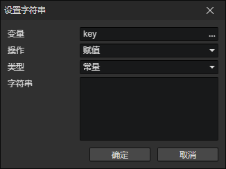

# 设置字符串

可用来设置角色属性、技能属性、装备属性等  
只有当变量是字符串类型或不存在，且操作值非空值时，才能成功写入

- 变量：写入的目标变量访问器
- 操作
  - 赋值：设置为操作值
  - 加法：添加操作值到尾部
- 类型
  - 常量：可以确定的字符串
  - 变量：使用变量访问器
  - 模板字符串：在字符串中可以插入变量标签
  - 字符串方法
    - 截取单个字符：从字符串中截取指定位置的字符(第一个字符的位置是0)
    - 截取部分内容：从字符串中截取指定位置的多个字符
    - 填充左侧内容：将一个数值或字符串填充到指定的长度，比如将数字1用"0"填充到2个长度，返回结果是"01"
    - 替换指定内容："abcdabcd"替换"ab"为"1"，返回结果是"1cdabcd"
    - 替换全部："abcdabcd"替换"ab"为"1"，返回结果是"1cd1cd"
  - 属性键：读取指定属性的键
  - 枚举：读取指定枚举的值
  - 对象
    - 角色 - 队伍ID
    - 角色 - 文件ID
    - 角色 - 动画动作名称：动作的枚举值
    - 技能 - 文件ID
    - 状态 - 文件ID
    - 装备 - 文件ID
    - 装备 - 装备槽：装备槽的枚举值
    - 物品 - 文件ID
    - 文件 - ID
  - 元素
    - 文本 - 内容
    - 文本框 - 文本
    - 对话框 - 内容
  - 列表项
    - 变量：存放列表对象的变量
    - 索引：读取列表中第N(0, 1, 2, ...)个位置的值
  - 参数：<显示文本><显示选项>指令中输入的参数
  - 脚本：Javascript的返回值
  - 其他
    - 事件触发键盘按键：获取当前触发的"键盘事件"的按键码
    - 初始位置 - 场景ID：场景舞台->上下文菜单->设置初始位置，可修改
    - 显示文本 - 内容：调用<显示文本>指令后，可以读取到指令中的内容
    - 显示选项 - 内容：调用<显示选项>指令后，可以读取到指令中的内容
    - 解析时间戳：将<设置数值>获取到的时间戳解析为指定格式的日期字符串
    - 屏幕截图(Base64)：截取当前游戏画面，转换为Base64字符串格式，可调用<加载图像>指令加载到图像元素中