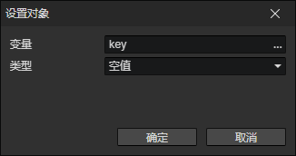

# 设置对象

可以存放角色、技能、状态、装备、物品、触发器、光源、元素到对象变量中，以便后面访问  
只有当变量是对象类型或不存在时，才能成功写入

- 变量：写入的目标变量访问器
- 类型
  - 空值：等效于删除该变量
  - 角色：使用角色访问器
  - 技能：使用技能访问器
  - 状态：使用状态访问器
  - 装备：使用装备访问器
  - 物品：使用物品访问器
  - 触发器：使用触发器访问器
  - 光源：使用光源访问器
  - 元素：使用元素访问器
  - 变量：使用变量访问器
  - 列表项
    - 变量：存放列表对象的变量
    - 索引：读取列表中第N(0, 1, 2, ...)个位置的值