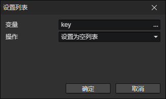

# 设置列表

可以存放任何类型的数据到列表中，用来遍历以减少重复性的操作，可以制作角色升级经验表  
只有当变量是对象类型或不存在时，才能成功创建列表

- 变量：写入的目标变量访问器
- 操作
  - 设置为空列表：初始化一个不包含任何值的列表
  - 设置数值列表：初始化一个包含数值的列表
  - 设置字符串列表：初始化一个包含字符串的列表
  - 设置布尔值：将指定位置的列表项设置为布尔值
  - 设置数值：将指定位置的列表项设置为数值
  - 设置字符串：将指定位置的列表项设置为字符串
  - 设置变量值：将指定位置的列表项设置为从变量中读取的值
  - 分割字符串：将一个字符串按指定分隔符分割，生成列表
  - 添加列表项：添加从变量中读取的值到列表的末尾
  - 移除列表项：从列表中移除从变量中读取的值
  - 获取属性名称：获取属性群组中的所有名称，生成列表
  - 获取属性键：获取属性群组中的所有键，生成列表
  - 获取枚举名称：获取枚举群组中的所有名称，生成列表
  - 获取枚举值：获取枚举群组中的所有值，生成列表
  - 获取角色目标池：获取角色的目标池中的所有目标角色，生成列表