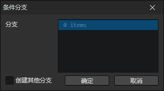
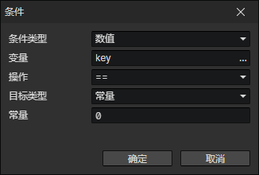

# 条件分支

- 分支列表：一个分支可以有多个条件，如果满足条件，则执行该分支的内容，否则判断下一个分支的条件
- 创建其他分支：启用时，当所有分支的条件都不满足，则进入<其他分支>

### 条件

- 条件类型
  - 布尔值
    - 变量：变量访问器
    - 操作
      - 等于(==)
      - 不等于(!=)
    - 目标类型
      - 空值：不存在
      - 常量
      - 变量
  - 数值
    - 变量：变量访问器
    - 操作
      - 等于(==)
      - 不等于(!=)
      - 大于等于(>=)
      - 小于等于(<=)
      - 大于(>)
      - 小于(<)
    - 目标类型
      - 空值：不存在
      - 常量
      - 变量
  - 字符串
    - 变量：变量访问器
    - 操作
      - 等于(==)
      - 不等于(!=)
      - 包含
      - 不包含
    - 目标类型
      - 空值：不存在
      - 常量
      - 变量
      - 枚举
  - 对象
    - 变量：变量访问器
    - 操作
      - 等于(==)：启用参数(目标类型)
      - 不等于(!=)：启用参数(目标类型)
      - 是角色
      - 是技能
      - 是状态
      - 是装备
      - 是物品
      - 是触发器
      - 是光源
      - 是元素
    - 目标类型
      - 空值：不存在
      - 角色：角色访问器
      - 技能：技能访问器
      - 状态：状态访问器
      - 装备：装备访问器
      - 物品：物品访问器
      - 触发器：触发器访问器
      - 光源：光源访问器
      - 元素：元素访问器
      - 变量：变量访问器
  - 角色
    - 角色：角色访问器
    - 操作
      - 在场景中并且已激活
      - 在场景中：角色在当前场景中
      - 不在场景中：角色不在当前场景中
      - 已激活：默认状态
      - 未激活：通过<设置激活状态>指令改变角色激活状态
      - 有目标：角色的目标池中存在目标角色对象
      - 没有目标：角色的目标池中不存在目标角色对象
      - 在屏幕中：角色在摄像机的可见区域内部
      - 是玩家角色：角色被设置为<玩家角色>
      - 是玩家队伍成员
      - 拥有技能
      - 拥有状态
      - 拥有物品
      - 拥有装备
      - 拥有技能快捷项：指定<快捷键>对应的是一个技能
      - 拥有物品快捷项：指定<快捷键>对应的是一个物品
      - 装备了
      - 是角色的队友：跟指定角色是同一个队伍
      - 是角色的朋友：跟指定角色的队伍关系是友好
      - 是角色的敌人：跟指定角色的队伍关系是敌对
      - 是队伍的成员：是指定队伍的成员
      - 是队伍的朋友：跟指定队伍的关系是友好
      - 是队伍的敌人：跟指定队伍的关系是敌对
  - 元素
    - 元素：元素访问器
    - 操作
      - 存在：从访问器中读取的元素是有效的
      - 不存在：从访问器中读取的元素是无效的
      - 可见：元素未被隐藏
      - 不可见：元素被隐藏
      - 对话框 - 已暂停
      - 对话框 - 更新中
      - 对话框 - 等待中
      - 对话框 - 已完成
  - 键盘
    - 按键：键盘按键码
    - 状态
      - 按下
      - 弹起
  - 鼠标
    - 按键
      - 左键
      - 中键
      - 右键
      - 后退键
      - 前进键
    - 状态
      - 按下
      - 弹起
  - 列表
    - 变量：列表变量访问器
    - 操作
      - 包含指定的变量值
      - 不包含指定的变量值
    - 变量
      - 从变量中读取操作值
  - 其他
    - 其他
      - 鼠标在窗口内部
      - 鼠标在窗口外部
      - 游戏已暂停
      - 游戏没有暂停