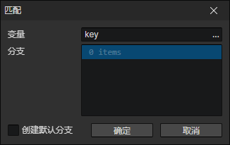

# 匹配

类似条件分支，如果确定变量值为有限的几个特定值，使用这个指令更加清晰易懂，性能也略有提高。

- 变量：目标变量访问器
- 分支列表：一个分支可以有多个条件，如果满足任意条件，则执行该分支的内容，否则判断下一个分支的条件
- 创建默认分支：启用时，当所有分支的条件都不满足，则进入<默认分支>

### 条件

- 类型
  - 空值：不存在
  - 布尔值：常量
  - 数值：常量
  - 字符串：常量
  - 属性键：用户设置的属性键(字符串)
  - 枚举：用户设置的枚举值(字符串)
  - 键盘：键盘按键码(字符串)
  - 鼠标：鼠标按键码(数值)
  - 变量：使用变量访问器