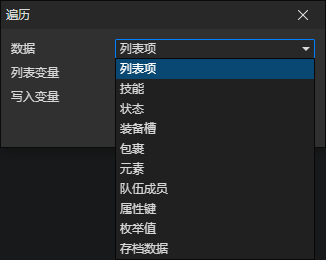

# 遍历

批量处理一些数据，以减少重复性的工作。比如遍历队伍成员：一个一个地获取角色进行处理。

- 数据
  - 列表项：读取列表中的所有数据
  - 技能：读取角色的所有技能
  - 状态：读取角色的所有状态
  - 装备槽：读取角色装备槽中的所有装备
  - 库存：读取角色库存中的所有物品和装备
  - 元素：读取指定元素的所有子元素
  - 队伍成员：读取玩家队伍的所有成员
  - 属性键：读取指定属性群组中的所有属性键
  - 枚举值：读取指定枚举群组中的所有枚举值
  - 存档数据：读取所有存档索引(0, 1, 2, ...)，并读取存档中的本地变量
- 写入变量：将读取到的数据写入到指定的变量

:::tip

遍历<存档数据>比较特殊，它将存档索引写入到指定变量中，同时读取保存时写入的本地变量。  
假设保存游戏时写入了foo, bar变量，那么在遍历时也会生成foo, bar这两个本地变量。

:::