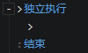

# 独立执行

将块中的指令分离出来异步执行

:::tip

事件的执行被设计成了跟宿主对象绑定在一起  
假设怪物自动执行了一个循环的AI事件  
当怪物被设为未激活(死亡)或被删除时，事件就会停止执行，从而避免了无限循环  
当玩家踩到区域触发事件调用了<加载场景>指令时，事件的宿主"区域"也随着当前场景被删除了  
接着指令异步加载场景，发生了短暂的等待，等待后的指令随着宿主被销毁将不再执行  
把指令写到独立执行块中(委托给系统)，能够保证事件宿主对象被删除后还能接着执行  
同理，点击"开始游戏"按钮后如果删除了元素，就需要将后续逻辑写在独立执行块中保证接着运行

:::