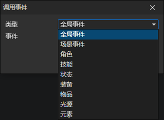

# 调用事件

- 类型
  - 全局事件：同步调用
  - 场景事件：异步调用
  - 角色：异步调用
  - 技能：异步调用
  - 状态：异步调用
  - 装备：异步调用
  - 物品：异步调用
  - 光源：异步调用
  - 元素：异步调用

:::tip

同步调用：  
相当于把指令嵌入到本事件中运行，因此变量是共享的，等待调用的事件执行完毕后继续执行后面的指令

异步调用：  
调用事件后不影响当前事件的执行，在被调用的事件中不能直接访问当前事件的本地变量

:::