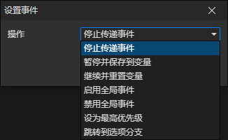

# 设置事件

- 操作
  - 停止传递事件：一般用在UI元素上，当用户点击一个元素后，会先触发该元素上的点击事件，再触发父元素的点击事件，一层层往上传递过去，当执行了这个操作后，将会停止传递。
  - 暂停并保存到变量：执行这个操作后会暂停当前正在执行的事件，并把事件保存到对象变量中。
  - 继续并重置变量：恢复被暂停的事件，并将该变量设置为空值。
  - 启用全局事件：启用的全局事件，自动触发特定事件的功能将恢复正常。
  - 禁用全局事件：禁用的全局事件，将不再自动触发特定事件（键盘按下、鼠标按下等）。
  - 设为最高优先级：当存在多个同类型的事件（如鼠标按下）时，让被设为最高优先级的事件第一个执行，可配合停止传递事件操作，阻止事件的传递。一旦事件被设为最高优先级，该事件在游戏暂停时也能正常触发
  - 跳转到选项分支：在调用<显示选项>指令后，可以进入指定的选项分支，用来自定义选择框界面的一个操作。