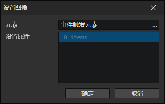
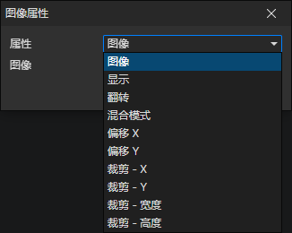

# 设置图像

- 元素：图像元素访问器
- 属性列表：可以同时设置多个图像元素的属性

### 图像属性

- 属性
  - 图像
  - 显示
    - 拉伸
    - 平铺
    - 裁剪
    - 切片
  - 翻转
    - 不翻转
    - 水平翻转
    - 垂直翻转
    - 水平垂直翻转
  - 混合模式
    - 正常
    - 加法
    - 减法
    - 遮罩
  - 偏移X
  - 偏移Y
  - 裁剪 - X
  - 裁剪 - Y
  - 裁剪 - 宽度
  - 裁剪 - 高度

- [查看图像属性说明](/docs/inspectors/ui/ui-image)