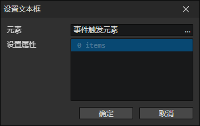
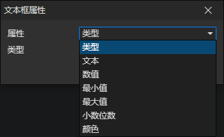

# 设置文本框

- 元素：文本框元素访问器
- 属性列表：可以同时设置多个文本框元素的属性

### 文本框属性

- 属性
  - 类型
    - 文本
    - 数值
  - 文本：类型为文本才可写入
  - 数值：类型为数值才可写入
  - 最小值
  - 最大值
  - 小数位数
  - 颜色
- [查看文本框属性说明](/docs/inspectors/ui/ui-textbox)