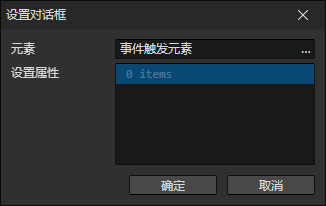
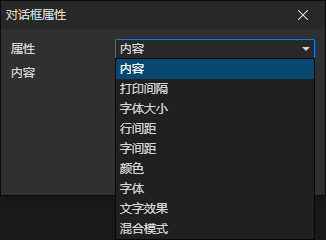

# 设置对话框

- 元素：对话框元素访问器
- 属性列表：可以同时设置多个对话框元素的属性

### 对话框属性

- 属性
  - 内容：通过右键菜单插入富文本标签和变量
  - 打印间隔
  - 字体大小
  - 行间距
  - 字间距
  - 颜色
  - 字体
  - 文字效果
    - 无
    - 阴影
    - 描边
    - 轮廓
  - 混合模式
    - 正常
    - 加法
    - 减法
- [查看对话框属性说明](/docs/inspectors/ui/ui-dialogbox)