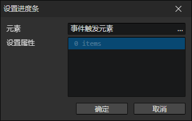
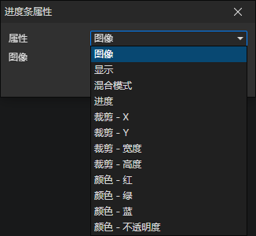

# 设置进度条

- 元素：进度条元素访问器
- 属性列表：可以同时设置多个进度条元素的属性

### 进度条属性

- 属性
  - 图像
  - 显示
  - 混合模式
  - 进度
  - 裁剪 - X
  - 裁剪 - Y
  - 裁剪 - 宽度
  - 裁剪 - 高度
  - 颜色 - 红
  - 颜色 - 绿
  - 颜色 - 蓝
  - 颜色 - 不透明度
- [查看进度条属性说明](/docs/inspectors/ui/ui-progressbar)