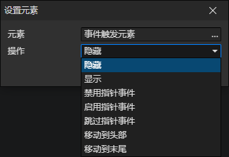

# 设置元素

- 元素：元素访问器
- 操作
  - 隐藏：隐藏元素后，将不再渲染它和它的后代元素（实际上仍然存在）。
  - 显示：解除元素的隐藏状态。
  - 禁用指针事件：禁止自动触发该元素和它的后代元素的所有指针事件（包括鼠标按下这类事件）。
  - 启用指针事件：恢复元素指针事件的自动触发。
  - 跳过指针事件：禁止自动触发该元素的所有指针事件，但是不禁止它的后代元素。
  - 移动到头部：将该元素从它父元素的子元素列表中，移动到第一个位置（总是被其他子元素遮挡，相等于置于底部）。
  - 移动到末尾：将该元素从它父元素的子元素列表中，移动到最后一个位置（总是遮挡其他子元素，相当于置于顶部）。