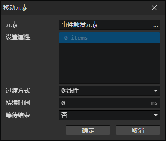
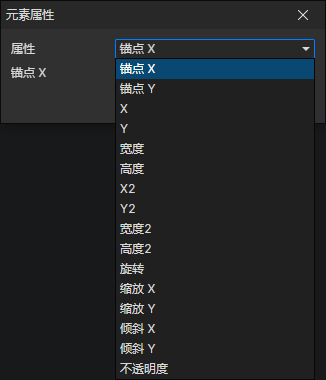

# 移动元素

- 元素：元素访问器
- 属性列表：可以同时设置多个元素的属性

### 元素属性

- 属性
  - 锚点X
  - 锚点Y
  - X
  - Y
  - 宽度
  - 高度
  - X2：父元素宽度的比例
  - Y2：父元素高度的比例
  - 宽度2：父元素宽度的比例
  - 高度2：父元素高度的比例
  - 旋转
  - 缩放X
  - 缩放Y
  - 倾斜X
  - 倾斜Y
  - 不透明度
