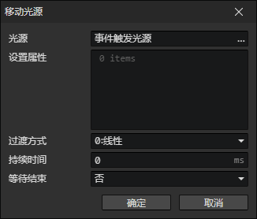
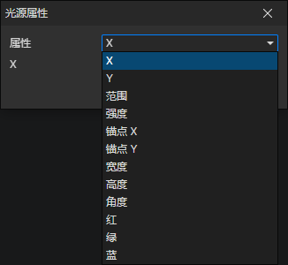

# 移动光源

- 光源：光源访问器
- 属性列表：可以同时设置多个光源的属性

### 光源属性

- 属性
  - X
  - Y
  - 点光源 - 范围
  - 点光源 - 强度
  - 区域光源 - 锚点X
  - 区域光源 - 锚点Y
  - 区域光源 - 宽度
  - 区域光源 - 高度
  - 区域光源 - 角度
  - 红
  - 绿
  - 蓝
- [查看光源属性说明](/docs/inspectors/scene/scene-light)