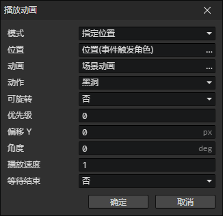

# 播放动画

- 模式
  - 指定位置：动画放置在固定位置
  - 绑定角色：动画跟随角色一起移动
- 动画：动画文件
- 动作：选中的动画文件包含的动作
- 可旋转：开启时，动画受<角度>影响进行旋转
- 优先级：动画在计算遮挡关系时排序优先级，优先级 = 1表示向下偏移1格图块进行排序，更容易遮挡住其他动画。
- 偏移Y：动画渲染位置的垂直偏移距离(单位：像素)
- 角度：动画的角度，会影响<动作方向>的切换
- 播放速度
- 等待结束：动画播放结束后继续执行事件指令

:::tip

如果动画是循环的，则永远不会结束。

:::