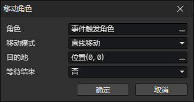

# 移动角色

- 角色：角色访问器
- 移动模式
  - 停止移动：停止角色的移动包括跟随行为。
  - 持续移动：朝指定角度持续移动，直到停止移动。
  - 直线移动：直线移动到目标位置。
  - 计算路径：自动寻路到目标位置。
  - 计算路径 - 绕过角色：自动寻路到目标位置，并绕过场景中的角色。
  - 传送：立即移动到目标位置。
- 等待结束：等待角色移动结束，执行后面的事件指令。