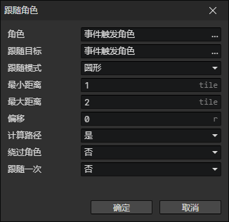

# 跟随角色

- 角色：角色访问器
- 跟随目标：角色访问器
- 跟随模式
  - 圆形：角色A在一个圆形范围内跟随角色B。
    - 最小距离：当距离小于最小距离时，角色A会远离角色B。
    - 最大距离：当距离大于最大距离时，角色A会接近角色B。
    - 偏移：如果有多名角色跟随一个角色，并且是相同的跟随距离时，可以分别设置不同的偏移值，避免重叠。
  - 矩形：角色A在一个矩形范围内跟随角色B。
    - 最小距离：当水平距离小于最小距离时，角色A会远离角色B。
    - 最大距离：当水平距离大于最大距离时，角色A会接近角色B。
    - 垂直距离：当角色之间的Y轴距离大于"垂直距离"时，角色A会在Y轴上接近角色B。
  - 计算路径：跟随的过程中不断自动寻路，启用参数(绕过角色)
  - 绕过角色：计算路径时绕过其他角色。
  - 跟随一次：到达目的地时停止跟随。

:::tip

圆形跟随模式

- 可用来跟随队友，也可用来跟随敌人，接近目标并发动技能（近战职业），或者通过提高最小距离来保持跟敌人的距离（远程职业）。

矩形跟随模式

- 当攻击方向只有左右两个方向，适合用这种跟随模式。

:::