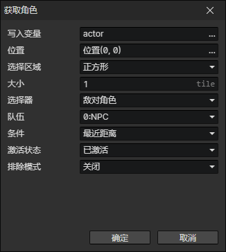

# 获取角色

- 写入变量：将获取到的角色写入到指定的变量
- 位置：从指定的场景位置获取角色
- 选择区域
  - 正方形：以指定位置为中心，获取正方形范围内的一个角色
    - 大小：正方形边长(单位：图块)
  - 圆形：以指定位置为中心，获取圆形范围内的一个角色
    - 半径：圆形半径(单位：图块)
- 选择器
  - 敌对角色：指定队伍的敌对角色，启用参数(队伍)
  - 友好角色：指定队伍的友好角色，启用参数(队伍)
  - 队伍成员：指定队伍的队伍成员，启用参数(队伍)
  - 任意角色
- 队伍
- 条件
  - 最近距离：离指定位置最近距离的角色
  - 最远距离：离指定位置最远距离的角色
  - 最小属性值：指定的属性值最小的角色，启用参数(属性)
  - 最大属性值：指定的属性值最大的角色，启用参数(属性)
  - 最小属性比率：两个属性值比率最小的角色，启用参数(属性，属性2)
  - 最大属性比率：两个属性值比率最大的角色，启用参数(属性，属性2)
  - 随机：随机选择一个角色
- 激活状态
  - 已激活：要求角色必须已激活
  - 未激活：要求角色必须未激活
  - 任意状态
- 排除模式
  - 关闭
  - 排除角色：不能是指定角色
  - 排除队伍：不能是指定队伍的角色