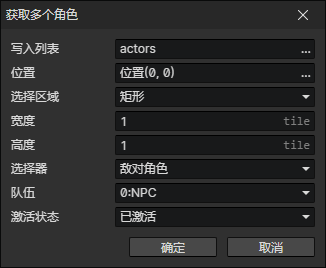

# 获取多个角色

- 写入列表：把生成的角色列表写入到该变量
- 位置：从指定的场景位置获取角色
- 选择区域
  - 矩形：以指定位置为中心，获取矩形范围内的角色
    - 宽度：矩形宽度(单位：图块)
    - 高度：矩形高度(单位：图块)
  - 圆形：以指定位置为中心，获取圆形范围内的角色
    - 半径：圆形半径(单位：图块)
- 选择器
  - 敌对角色：指定队伍的敌对角色，启用参数(队伍)
  - 友好角色：指定队伍的友好角色，启用参数(队伍)
  - 队伍成员：指定队伍的队伍成员，启用参数(队伍)
  - 任意角色
- 队伍
- 激活状态
  - 已激活：要求角色必须已激活
  - 未激活：要求角色必须未激活
  - 任意状态