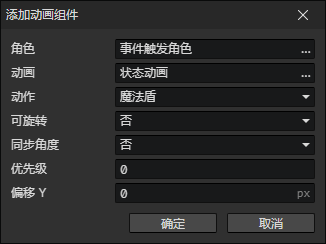

# 添加动画组件

- 角色：角色访问器
- 动画：动画文件
- 动作：当前动画的一个动作（动画 + 动作 = 动画组件的ID）
- 可旋转：开启时，动画受<角度>影响进行旋转
- 同步角度：开启时，动画的角度会自动设置为角色的角度
- 优先级：动画组件在计算遮挡关系时排序优先级
  - 小于0：动画组件显示在角色动画下面
  - 大于或等于0：动画组件显示在角色动画上面
- 偏移Y：动画渲染位置的垂直偏移距离(单位：像素)

:::tip

例子：在角色添加了"魔法盾"状态后，添加相关的动画组件，当"魔法盾"状态消失后，移除相关的动画组件。

:::