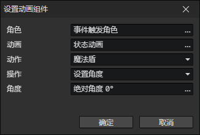

# 设置动画组件

- 角色：角色访问器
- 动画：动画文件
- 动作：当前动画的一个动作（动画 + 动作 = 动画组件的ID）
- 操作
  - 设置角度：如果动画开启了旋转，同时计算动作方向和旋转角度，否则只计算动作方向。
  - 设置缩放系数
  - 设置播放速度
  - 设置不透明度
  - 设置优先级
  - 设置偏移Y
  - 设置精灵图
  - 播放动作
    - 等待结束：等待动画播放完毕，继续执行后面的事件指令
  - 停止动作
